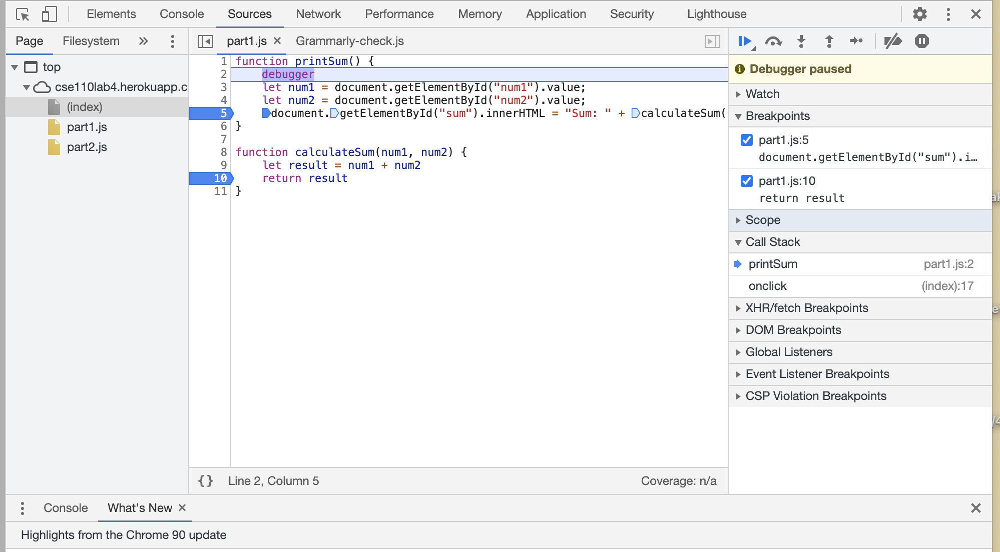
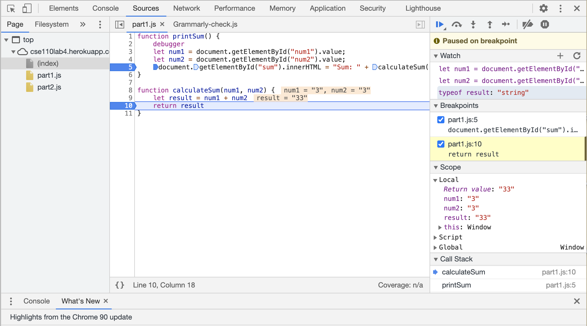
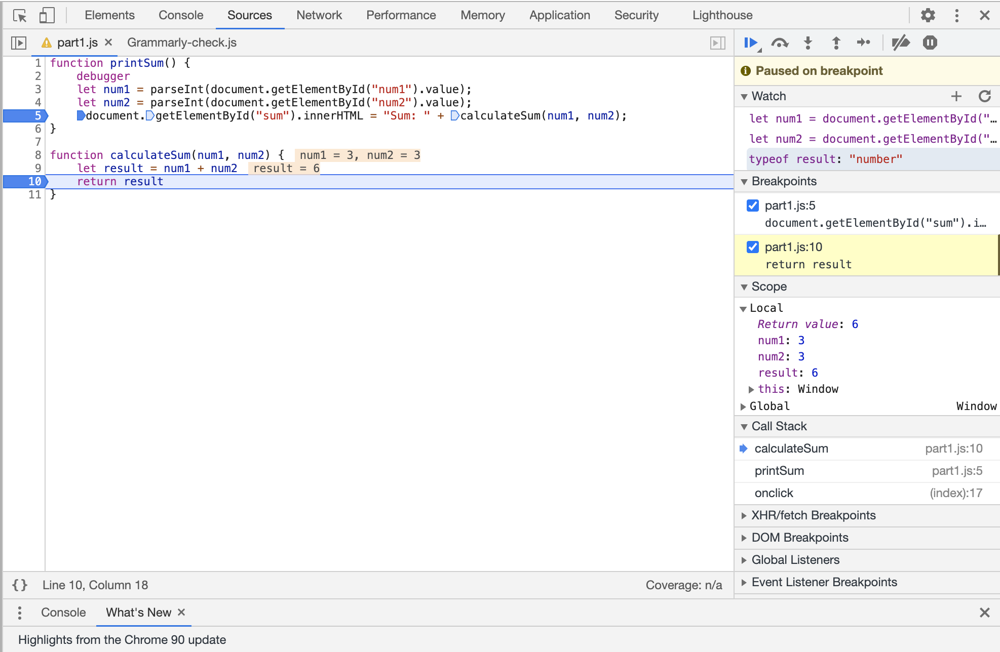
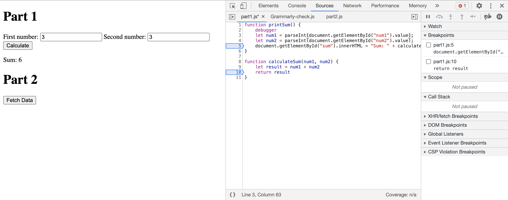

Added Breakpoints:  
 

Added Watch:  

1. The bug was that getElementById() returns a string.  
2. To fix it, I used the parseInt() to convert the string into a number. In the screenshot, I tested with 3+3 which returned the correct result of 6.     

Solution:  
 
  

3. The new json file is citylots.json.
4. par2.js initiated the download of the new file. 
5. The new file's size is 11.7 MB.
6. It took 2.06 seconds to download. 
7. The User-Agent is: ``Mozilla/5.0 (Macintosh; Intel Mac OS X 10_15_7) AppleWebKit/537.36 (KHTML, like Gecko) Chrome/90.0.4430.85 Safari/537.36``.  
8. The server is: ``Apache``.
9. The date last modified is: ``Tue, 26 Jan 2021 22:14:13 GMT``.
10. The Content-Type is: ``application/json``. 
11. The fetchData method. 
